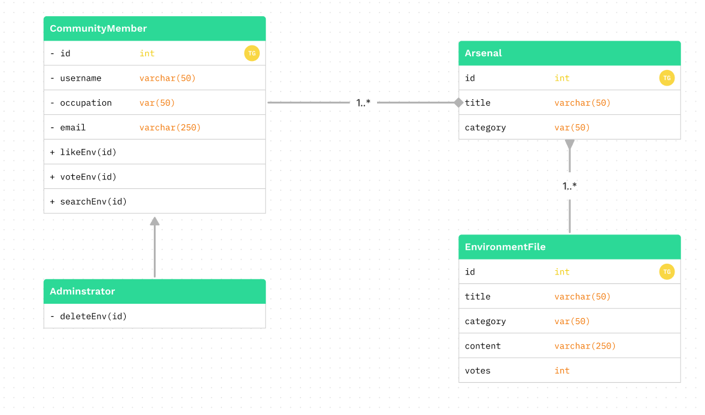
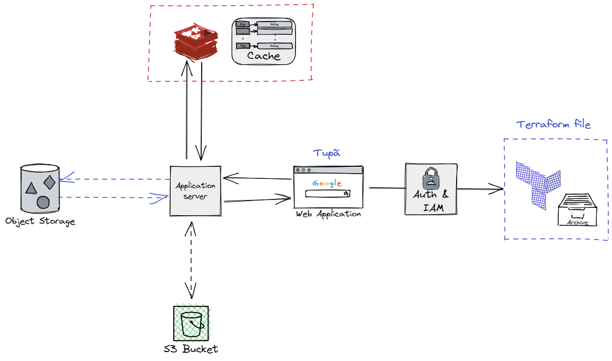

## Prelude

<b>Terraform hub</b> is an open source repositories service created with the aim of sharing pre-configured environments in terraform format and assisting in their development.

 

## Stories

As a <b>member of the community</b>, I would like to list files by environment type, so that my search is more efficient in the objective in want to achieve.

As a <b>member of the community</b>, I'd like to vote for the environment files that make the most sense for the given context, so thast it ranks better and can be be found by more people.

As a <b>member of the community</b>, I would like to bookmark environment files and add them to my arsenal so that i can center my preferences.

As a <b>member of the community</b>, I would like to share a file link as an image to preview the code to a friend.

As a <b>adminstrator</b>, I would like to exclude environment files if they contain sensitive information, to protect the whole community.

As a <b>member of the community</b>, I would like to create new categories to be able to a do a better filter.

 

### Diagram

 

### Schema

