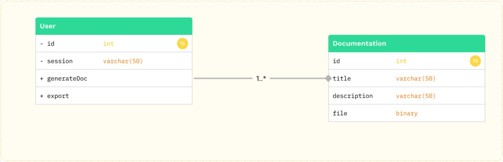

## Prelude

<b>JSONDOC</b> é uma plataforma open source de documentação de API's.

 

## Team
   - Miguel Neto  
   - Rafael Peres
   - Willian Augusto

## Stories

As a <b>member of the community</b>, I'd like to generate documentation for my API, so that other developers on the team can have more autonomy when using it.

As a <b>member of the community</b>, I'd like to generate documentation for my API through a JSON file, so that the process of generating the API becomes something simple and fast.

As a <b>member of the community</b>, I'd like to have access to all routes, parameters, description and all information regarding the API, so that the team does not make mistakes in development.

As a <b>member of the community</b>, I'd like to download the generated documentation so it can be made available to team members.

 

### Diagram

 

